# 🚀 Phoenix DevOps Platform


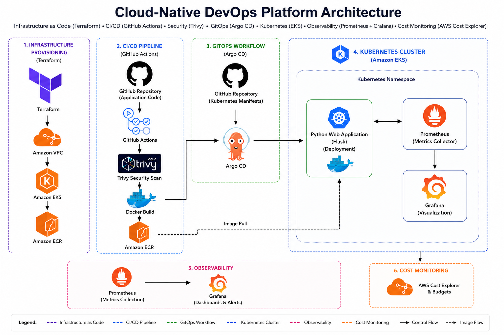

A production-style GitOps platform demonstrating Infrastructure as Code (IaC), Continuous Integration/Continuous Deployment (CI/CD), Kubernetes orchestration, observability, and security scanning.

This project was designed to showcase modern DevOps practices using Terraform, AWS, Docker, Kubernetes, ArgoCD, Prometheus, Grafana, GitHub Actions, and Trivy.

---

# Table of Contents

- [Phoenix DevOps Platform](#-phoenix-devops-platform)
- [Project Overview](#-project-overview)
- [🏗️ Architecture Diagram](#️-architecture-diagram)
- [📸 Project Screenshots](#-project-screenshots)
  - [Terraform Infrastructure](#terraform-infrastructure)
  - [AWS EKS Cluster](#aws-eks-cluster)
  - [Amazon ECR Repository](#amazon-ecr-repository)
  - [GitHub Actions Pipeline](#github-actions-pipeline)
  - [ArgoCD Dashboard](#argocd-dashboard)
  - [Kubernetes Resources](#kubernetes-resources)
  - [Grafana Dashboard](#grafana-dashboard)
  - [Load Testing Results](#load-testing-results)
- [Technology Stack](#-technology-stack)
- [📁 Project Structure](#-project-structure)
- [🌐 Infrastructure Architecture](#-infrastructure-architecture)
    - [Components](#components)
    - [Features](#features)
- [⚙️ CI/CD Pipeline](#️-cicd-pipeline)
  - [Workflow](#workflow)
- [🔒 Security Integration](#-security-integration)
- [🚢 GitOps Workflow](#-gitops-workflow)
  - [Deployment Flow](#deployment-flow)
    - [GitOps Benefits](#gitops-benefits)
- [☸️ Kubernetes Deployment](#️-kubernetes-deployment)
    - [Deployment Features](#deployment-features)
    - [Kubernetes Components](#kubernetes-components)
- [📊 Monitoring Stack](#-monitoring-stack)
  - [Monitoring Flow](#monitoring-flow)
- [📈 Application Metrics](#-application-metrics)
- [💰 AWS Cost Monitoring](#-aws-cost-monitoring)
- [🧪 Performance Validation](#-performance-validation)
    - [Test Configuration](#test-configuration)
    - [Results](#results)
- [🚀 Running Locally](#-running-locally)
  - [Build Docker Image](#build-docker-image)
  - [Load Image Into Kind](#load-image-into-kind)
  - [Deploy Application](#deploy-application)
  - [Verify Resources](#verify-resources)
- [🔍 Accessing Services](#-accessing-services)
  - [Application](#application)
  - [ArgoCD](#argocd)
  - [Grafana](#grafana)
- [🎯 Key DevOps Concepts Demonstrated](#-key-devops-concepts-demonstrated)
- [🔮 Future Enhancements](#-future-enhancements)
- [👨‍💻 Author](#-author)
- [⭐ Project Highlights](#-project-highlights)

---

# 📌 Project Overview

The Phoenix DevOps Platform automates the complete software delivery lifecycle:

- Infrastructure provisioning using Terraform
- Containerized application deployment using Docker
- Security scanning using Trivy
- Continuous Integration using GitHub Actions
- GitOps deployment using ArgoCD
- Kubernetes orchestration using EKS
- Monitoring using Prometheus
- Visualization using Grafana
- AWS cost monitoring using Cost Explorer and Budgets

---

# 📋 Prerequisites

Before deploying this platform, ensure you have the following tools installed:

- **AWS CLI** — configured with credentials (access key + secret key)
- **Terraform** — v1.5+
- **kubectl** — matching your EKS cluster version
- **Docker** — for building container images
- **GitHub account** — with secrets configured for CI/CD

---

# 🏗️ Architecture Diagram

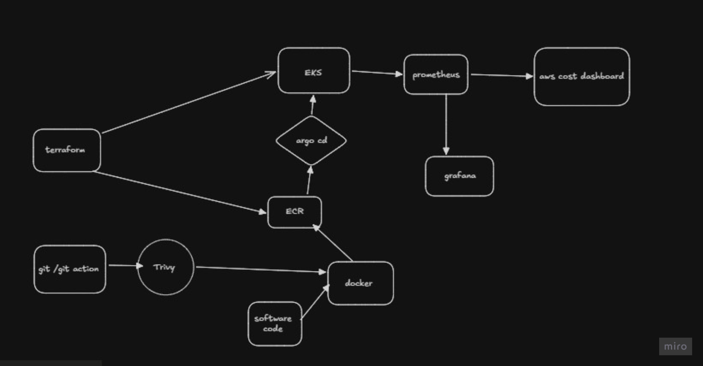

---

# 📸 Project Screenshots

## Terraform Infrastructure

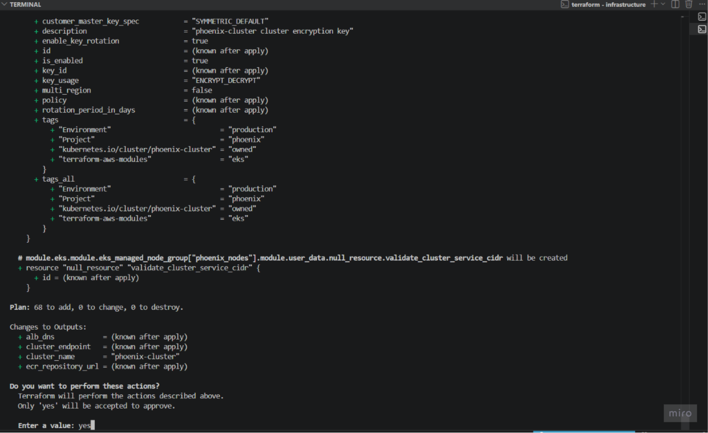

---

## AWS EKS Cluster

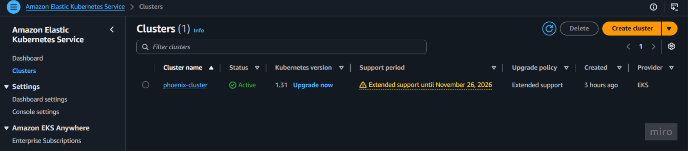

---

## Amazon ECR Repository

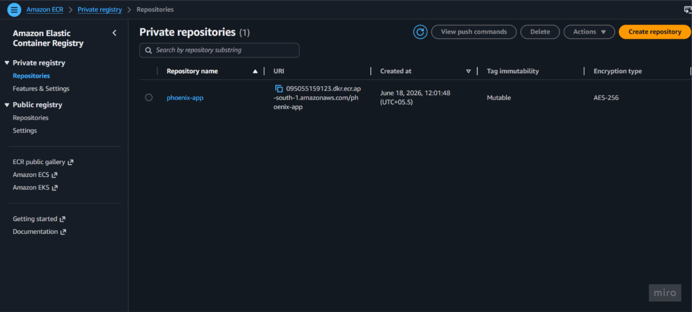
---

## GitHub Actions Pipeline

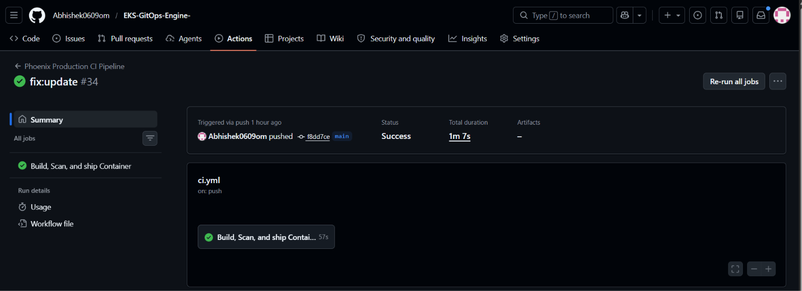

---

## ArgoCD Dashboard

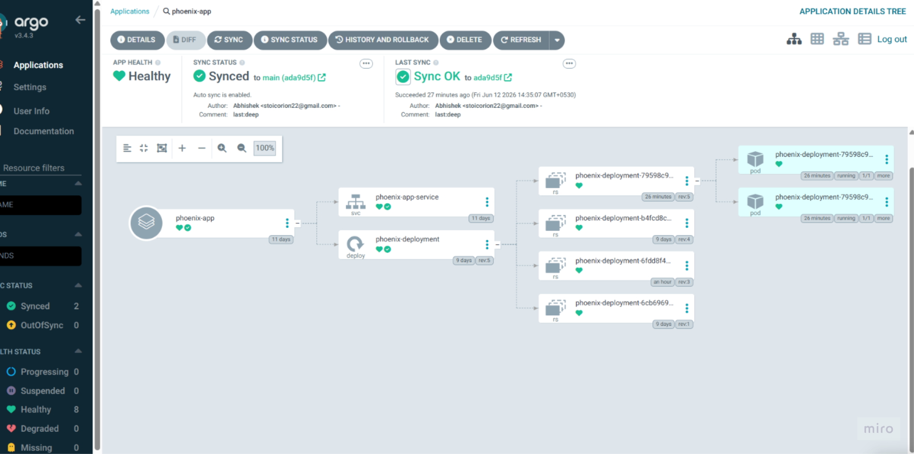

---

## Kubernetes Resources

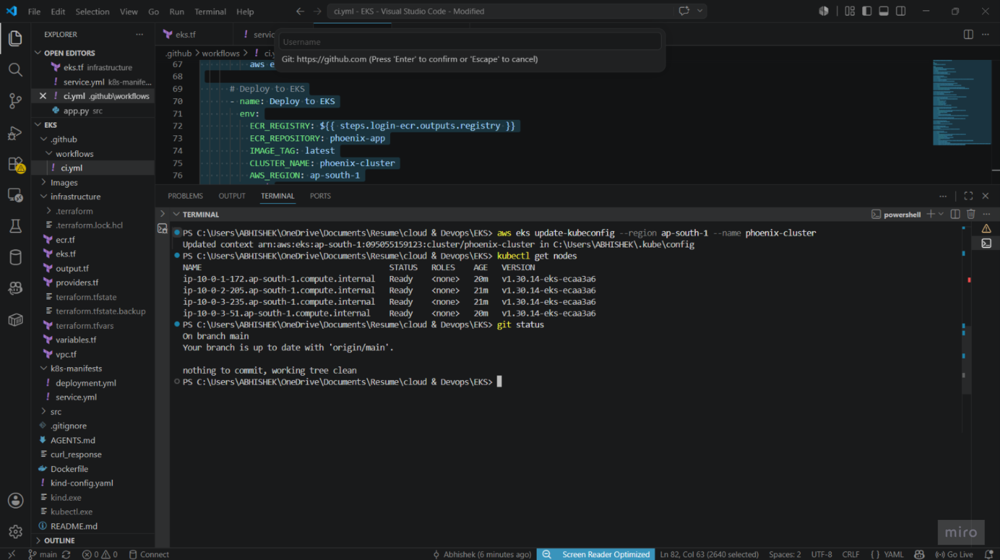
---

## Grafana Dashboard

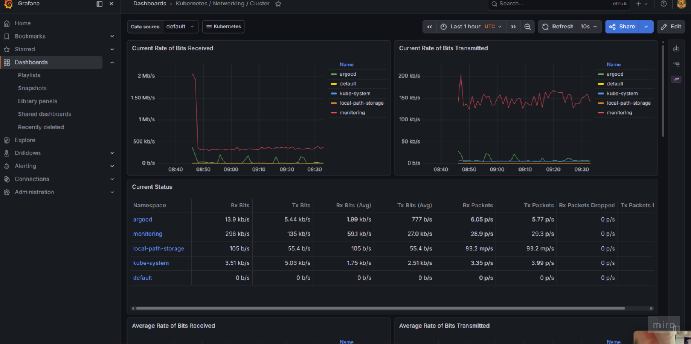

---

## Load Testing Results

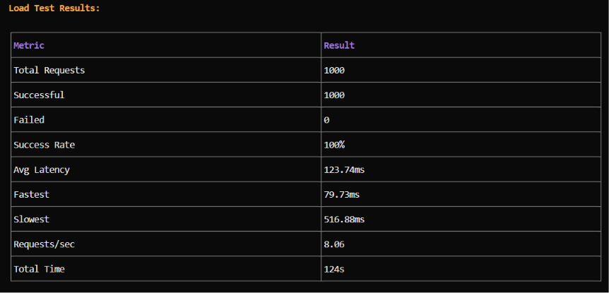

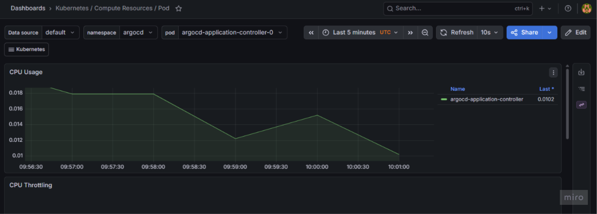

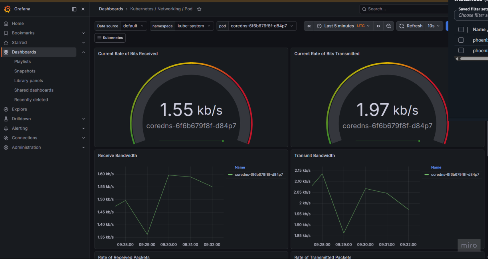
---

# 🔧 Technology Stack

| Category | Technology |
|-----------|------------|
| Infrastructure | Terraform |
| Cloud Provider | AWS |
| Containerization | Docker |
| Container Registry | Amazon ECR |
| Kubernetes | Amazon EKS |
| GitOps | ArgoCD |
| Monitoring | Prometheus |
| Visualization | Grafana |
| CI/CD | GitHub Actions |
| Security Scanning | Trivy |
| Application | Python Flask |

---

# 📁 Project Structure

```text
phoenix-devops-platform/
│
├── .github/
│   └── workflows/
│       └── deploy.yaml
│
├── k8s-manifests/
│   ├── deployment.yaml
│   └── service.yaml
│
├── src/
│   └── app.py
│
├── terraform/
│   ├── providers.tf
│   ├── vpc.tf
│   ├── eks.tf
│   ├── ecr.tf
│   └── output.tf
│
├── Dockerfile
├── requirements.txt
├── .gitignore
└── README.md
```

---

# 🌐 Infrastructure Architecture

Terraform provisions the complete AWS infrastructure.

### Components

- Amazon VPC
- Public Subnets
- Private Subnets
- NAT Gateway
- Amazon EKS Cluster
- Amazon ECR Repository

### Features

- Infrastructure as Code
- Reproducible environments
- Version-controlled infrastructure
- Multi-AZ architecture

---

# ⚙️ CI/CD Pipeline

The CI/CD workflow automatically validates, scans, builds, and publishes container images.

## Workflow

```text
Developer Push
        │
        ▼
GitHub Repository
        │
        ▼
GitHub Actions
        │
        ▼
Trivy Security Scan
        │
        ▼
Docker Build
        │
        ▼
Amazon ECR
```

---

# 🔒 Security Integration

The platform uses Trivy to scan container images for:

- Critical vulnerabilities
- High vulnerabilities
- Dependency issues
- Container security risks

Benefits:

- Shift-left security
- Early vulnerability detection
- Secure deployment pipeline

---

# 🚢 GitOps Workflow

ArgoCD continuously monitors the Git repository and automatically synchronizes Kubernetes resources.

## Deployment Flow

```text
GitHub Repository
        │
        ▼
ArgoCD
        │
        ▼
Amazon EKS
```

### GitOps Benefits

- Declarative deployments
- Automatic synchronization
- Self-healing infrastructure
- Full audit trail

---

# ☸️ Kubernetes Deployment

The application is deployed using Kubernetes manifests.

### Deployment Features

- Replica-based architecture
- Resource limits
- Resource requests
- Rolling updates
- Self-healing pods

### Kubernetes Components

- Deployment
- Service
- Pods
- ReplicaSets

---

# 📊 Monitoring Stack

Prometheus collects metrics from the application and cluster resources.

Grafana visualizes those metrics through dashboards.

## Monitoring Flow

```text
Phoenix Application
        │
        ▼
Prometheus
        │
        ▼
Grafana
```

---

# 📈 Application Metrics

The Flask application exposes custom metrics.

Metrics include:

- Request count
- Request latency
- Endpoint monitoring
- Application availability

---

# 💰 AWS Cost Monitoring

AWS Cost Explorer and Budgets can be integrated to monitor cloud spending.

Features:

- Cost tracking
- Budget alerts
- Resource spending analysis
- Forecasting

---

# 🧪 Performance Validation

A load test was performed to validate application stability and cluster performance.

### Test Configuration

- Total Requests: 1000
- Concurrent Traffic: Multiple workers
- Environment: Kubernetes Cluster

### Results

| Metric | Result |
|----------|----------|
| Total Requests | 1000 |
| Successful Requests | 1000 |
| Failed Requests | 0 |
| Success Rate | 100% |

---

# 🚀 Running Locally

## Build Docker Image

```bash
docker build -t phoenix-app:local .
```

## Load Image Into Kind

```bash
kind load docker-image phoenix-app:local --name phoenix
```

## Deploy Application

```bash
kubectl apply -f k8s-manifests/
```

## Verify Resources

```bash
kubectl get pods
kubectl get svc
```

---

# 🔍 Accessing Services

## Application

```bash
kubectl port-forward deployment/phoenix-deployment 5000:5000
```

Application URL:

```text
http://localhost:5000
```

---

## ArgoCD

```bash
kubectl port-forward svc/argocd-server -n argocd 8080:443
```

Access:

```text
https://localhost:8080
```

---

## Grafana

```bash
kubectl port-forward svc/phoenix-monitoring-grafana -n monitoring 3000:80
```

Access:

```text
http://localhost:3000
```

---

# 🎯 Key DevOps Concepts Demonstrated

- Infrastructure as Code (Terraform)
- GitOps (ArgoCD)
- Containerization (Docker)
- Kubernetes Orchestration
- Continuous Integration
- Continuous Deployment
- Security Scanning
- Monitoring and Observability
- Cloud Cost Awareness
- Load Testing

---

# 🔮 Future Enhancements

Potential improvements:

- Horizontal Pod Autoscaler (HPA)
- Cluster Autoscaler
- Loki Log Aggregation
- Alertmanager
- AWS Load Balancer Controller
- ExternalDNS
- Multi-environment deployments
- Blue-Green deployments
- Canary deployments

---

# 👨‍💻 Author

Abhishek

DevOps | Cloud | Kubernetes | AWS | Terraform | GitOps

---

# ⭐ Project Highlights

- Terraform-provisioned AWS infrastructure
- Kubernetes-based deployment platform
- GitOps deployment with ArgoCD
- Security scanning with Trivy
- Monitoring with Prometheus and Grafana
- Containerized Python application
- Load-tested and validated deployment workflow
trigger

